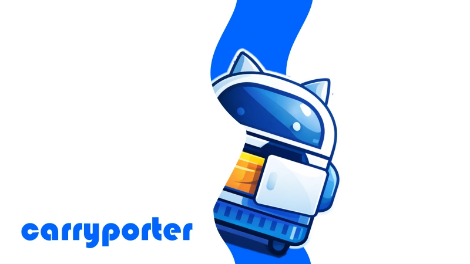
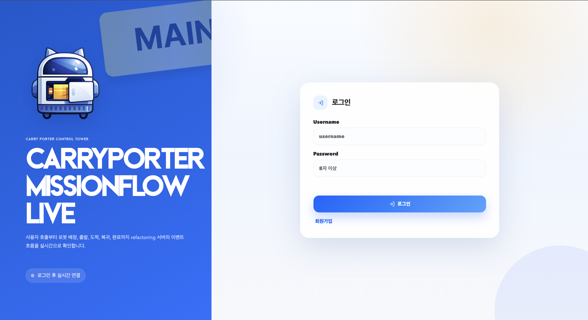
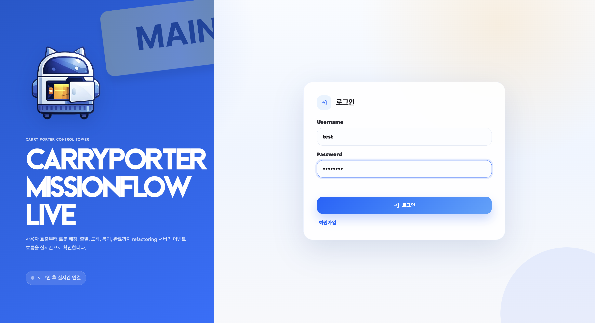
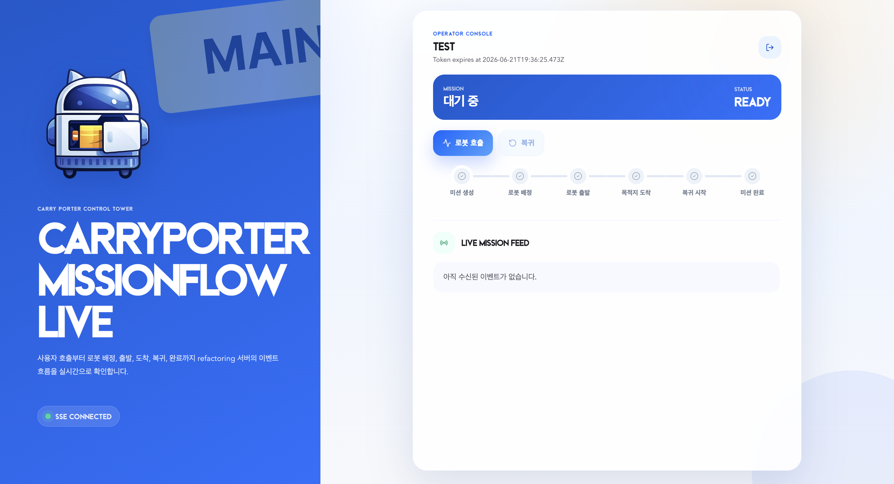
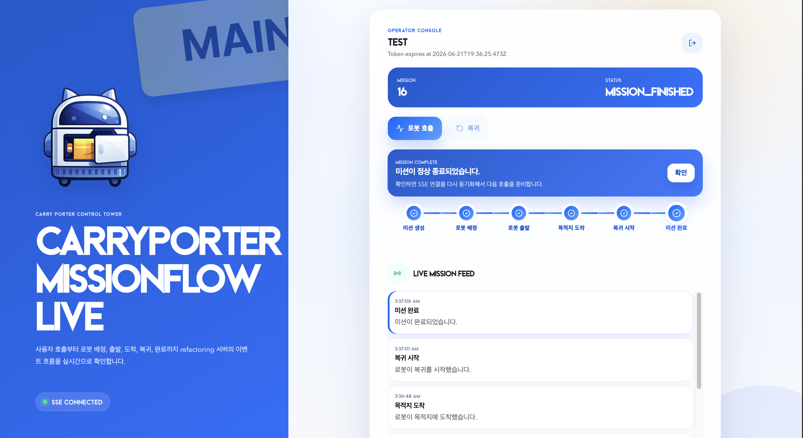
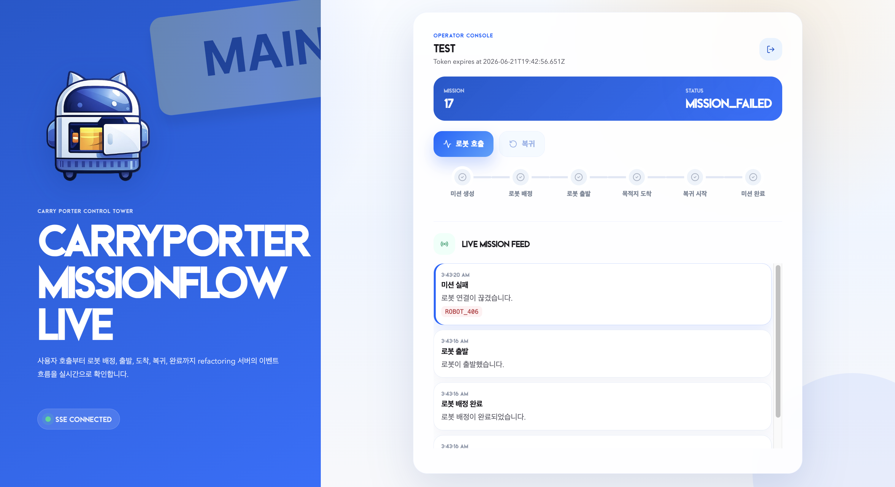
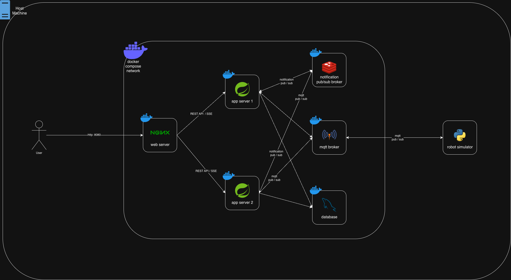
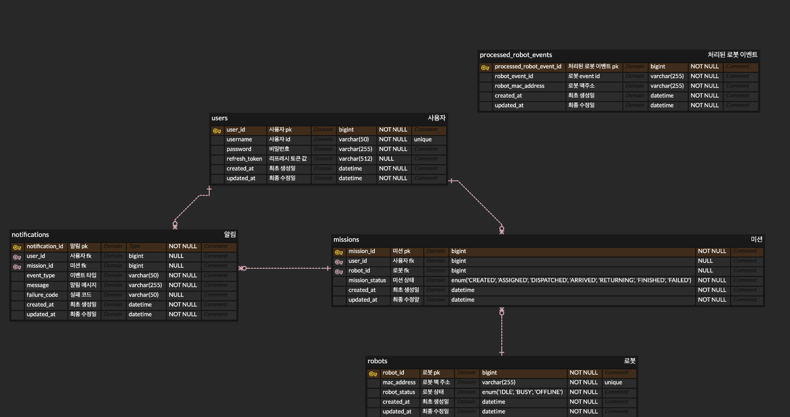

# Carry Porter Refactoring

## 1. 프로젝트 소개

### 개요

Carry Porter는 SSAFY에서 진행한 로봇 호출 서비스 팀 프로젝트입니다.  
이 저장소는 기존 프로젝트를 기반으로 미션 상태 흐름, 이벤트 구조, MQTT 통신, SSE 알림, 인증 구조를 다시 설계하고 직접 재구현한 리팩토링 프로젝트입니다.

### 프로젝트 정보

- 원본 프로젝트: [joonwan/carryporter](https://github.com/joonwan/carryporter)
- 진행 인원: [joonwan](https://github.com/joonwan)
- 담당 범위: 백엔드 리팩토링, MQTT Pipeline, SSE 알림, 인증, 멀티 인스턴스 실험 환경 구축

## 2. 화면 미리보기

<table>
  <tr>
    <td width="50%">
      <strong>로그인 화면</strong><br />
      
    </td>
    <td width="50%">
      <strong>회원가입 화면</strong><br />
      
    </td>
  </tr>
  <tr>
    <td width="50%">
      <strong>로그인 입력</strong><br />
      
    </td>
    <td width="50%">
      <strong>대기 상태</strong><br />
      
    </td>
  </tr>
  <tr>
    <td width="50%">
      <strong>미션 진행</strong><br />
      
    </td>
    <td width="50%">
      <strong>미션 완료</strong><br />
      
    </td>
  </tr>
  <tr>
    <td width="50%">
      <strong>네트워크 예외 처리</strong><br />
      
    </td>
    <td width="50%">
      <strong>로봇 연결 실패 알림</strong><br />
      로봇 연결이 끊긴 경우 미션을 실패 상태로 전환하고 SSE 알림으로 실패 사유를 전달합니다.
    </td>
  </tr>
</table>

## 3. 주요 개선 포인트

### MQTT 처리 구조 개선

- 기존: **Paho callback** 내부에서 topic 직접 파싱 및 `switch` 기반 메시지 분기
- 개선: **Spring Integration 기반 MQTT inbound / outbound pipeline**으로 재구성
- 결과: **Adapter, Transformer, Router, Service Activator** 책임 분리

### SSE 알림 구조 개선

- 기존: 이벤트 발생 시 메모리의 **`SseEmitter`**를 조회해 즉시 알림 전송
- 개선: 알림을 **DB에 먼저 저장한 뒤 SSE로 전송**
- 결과: SSE 재연결 시 이벤트 로그 재생 대신 **DB 기준 현재 진행 중인 미션 상태 동기화**

### 멀티 인스턴스 환경 대응 추가

- 문제: **`SseEmitter`가 각 Spring Boot 인스턴스 메모리에 저장**되어 다른 인스턴스에서 조회 불가
- 확인: 알림 생성 인스턴스와 SSE 연결 보유 인스턴스가 달라질 경우 **실시간 알림 전송 실패**
- 개선: **Redis Pub/Sub**로 알림 생성 사실을 모든 인스턴스에 전파
- 결과: 각 인스턴스가 자신이 보유한 **SSE 연결 여부를 확인한 뒤 알림 전송**

### MQTT 중복 메시지 방어 추가

- 문제: 멀티 인스턴스 환경에서 **동일 MQTT 메시지를 여러 인스턴스가 동시에 수신**
- 증상: **중복 상태 변경 및 중복 SSE 알림 발생**
- 개선 1: **MQTT shared subscription** 적용
- 개선 2: 로봇 메시지에 **`robot_event_id`** 추가
- 결과: **`processed_robot_events` 테이블**을 이용해 이미 처리한 로봇 이벤트 중복 방어

## 4. 시스템 구조

### System Architecture



### Component Roles

| Component | Role |
| --- | --- |
| Nginx | Load Balancer, Reverse Proxy, Static Web Server |
| Spring Boot App-1 | Application Server |
| Spring Boot App-2 | Application Server |
| MySQL | Database |
| Redis | Notification Pub/Sub Broker |
| Mosquitto | MQTT Message Broker |
| Robot Simulator | MQTT Robot Client |
| Browser | Web Client |

### ERD



## 5. 기술 스택

### Backend


### Database


### Messaging


### Infra


### Test


## 6. 실행 방법

### 1. Frontend 정적 파일 빌드

Nginx 컨테이너가 `frontend/dist`를 정적 파일로 서빙하므로 Docker Compose 실행 전에 프론트를 먼저 빌드합니다.

```bash
cd frontend
npm install
npm run build
cd ..
```

### 2. Docker Compose 실행

```bash
docker compose --env-file .env.local -f docker-compose.local.yaml up --build
```

실행 후 브라우저에서 아래 주소로 접속합니다.

```text
http://localhost:8080
```

### 3. 로봇 시뮬레이터 실행

```bash
cd clients/robot-simulator

python3 -m venv .venv
source .venv/bin/activate
pip install -r requirements.txt

export MQTT_BROKER_HOST=localhost
export MQTT_BROKER_PORT=1884
export ROBOT_MAC_ADDRESS=AA:BB:CC:DD:EE:01
export MQTT_QOS=1
export SIMULATED_TRAVEL_SECONDS=5

python3 robot_client.py
```

### 4. Docker Compose 종료

```bash
docker compose --env-file .env.local -f docker-compose.local.yaml down
```

### Frontend 개발 서버만 따로 실행하는 경우

프론트 UI만 빠르게 수정할 때는 Vite 개발 서버를 별도로 실행할 수 있습니다.

```bash
cd frontend
npm install
npm run dev
```

## 7. 관련 포스트

- [이벤트 기반 구조 설계]()
- [SSE 멀티 인스턴스 알림 전파 문제 해결]()
- [MQTT 중복 메시지 처리 문제 해결]()
- [Testcontainers 기반 동시성 테스트](https://joonwan.github.io/pessimistic-lock-concurrency-test)
