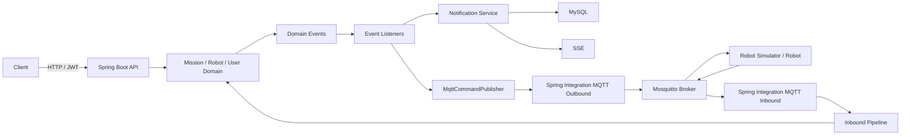
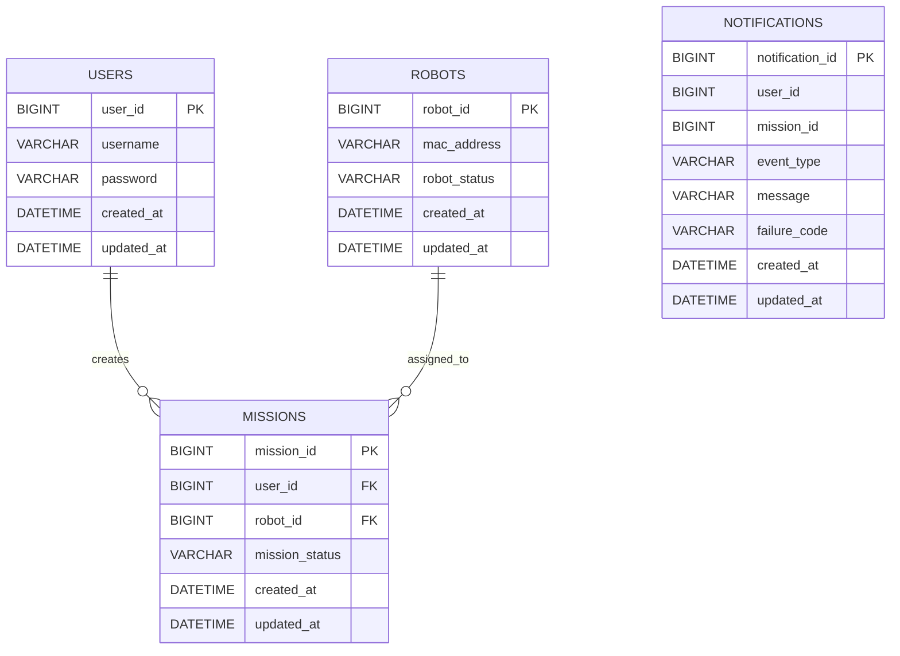

## 1. 프로젝트 소개

Carry Porter는 SSAFY에서 진행한 팀 프로젝트로, 사용자 요청부터 로봇 배정, 출발, 도착, 복귀, 종료까지의 흐름을 관리하는 로봇 호출 백엔드 시스템입니다.  
이 저장소는 기존 프로젝트([joonwan/carryporter](https://github.com/joonwan/carryporter))를 바탕으로, 미션 상태 흐름과 이벤트 구조를 다시 설계하고 MQTT / SSE / JWT 인증 구조를 포함한 전체 비즈니스 흐름을 재구성하며 리팩토링한 프로젝트입니다.

## 2. 진행 인원

- 리팩토링: [joonwan](https://github.com/joonwan)

## 3. 핵심 리팩토링 포인트

- SSE 실시간 알림 기능과 재구독 시 누락 알림 복구 구조 구축.
- Spring Integration 기반 MQTT 메시지 파이프라인을 구축.
- 이벤트 기반으로 비즈니스 흐름을 분리하는 Event-Driven Architecture를 설계 및 구축.

## 4. 주요 기능

- 회원가입 / 로그인 / JWT 기반 인증
- 미션 생성
- 로봇 자동 배정
- 미션 출발 / 도착 / 복귀 시작 / 종료 / 실패 처리
- MQTT 기반 로봇 명령 발행 및 상태 메시지 수신
- SSE 기반 실시간 미션 알림 전송
- `Last-Event-ID` 기반 누락 알림 복구
- 오래된 알림 정리 스케줄러 운영

## 5. 기술 스택

- Backend: Java 21, Spring Boot, Spring Web, Spring Data JPA, Spring Security
- Database: MySQL
- Messaging: Spring Integration, MQTT, Eclipse Paho, SSE
- Auth: JWT
- Test: JUnit 5, Testcontainers, Mockito, JaCoCo
- Infra: Docker, Mosquitto

## 6. 시스템 아키텍처

### 이벤트 흐름 요약

1. 사용자가 미션을 생성하면 `MissionCreatedEvent`가 발행됩니다.
2. 로봇 배정 리스너가 이벤트를 받아 로봇을 배정하고 `RobotAssignedEvent`를 발행합니다.
3. 미션 상태 리스너가 미션을 출발 상태로 변경하고 `MissionStartedEvent`를 발행합니다.
4. 로봇 명령 리스너가 MQTT `departure` 명령을 발행합니다.
5. 로봇이 `arrived`, `returned`, `emergency` 메시지를 보내면 inbound pipeline이 이를 수신 이벤트로 변환합니다.
6. 미션 서비스가 상태를 반영한 뒤 `MissionArrivedEvent`, `MissionFinishedEvent`, `MissionFailedEvent`를 발행합니다.
7. 알림 리스너가 알림을 DB에 저장하고, 커밋 이후 SSE로 전송합니다.
8. 사용자가 재구독하면 `Last-Event-ID` 이후의 누락 알림을 다시 전송합니다.

## 7. ERD

## 8. 트러블슈팅

- 동시성 제어 테스트 과정에서 겪은 트랜잭션 가시성 이슈 정리 예정
- SSE 재구독 기반 누락 알림 복구 구현 과정 정리 예정
- 블로그 포스팅 작성 후 링크 추가 예정
